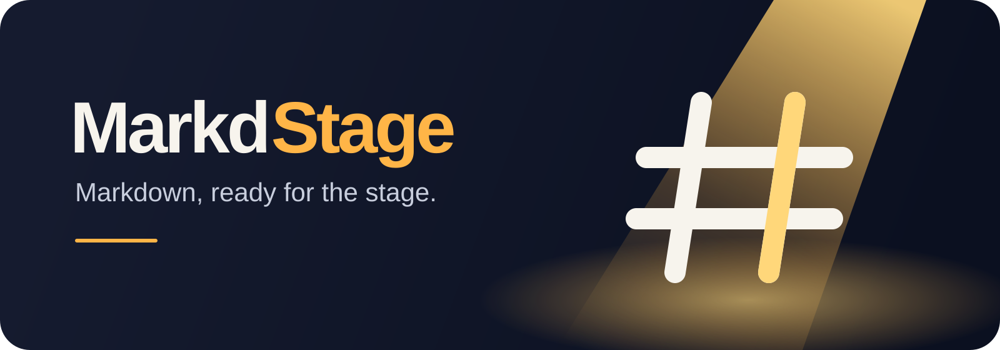

<p align="center">
  
</p>

<p align="center">
  <a href=".github/workflows/ci.yml"></a>
  <a href="LICENSE"></a>
  
  
</p>

<p align="center"><a href="README.md">English</a> | 日本語</p>

---

**MarkdStage for macOS** は、Markdownを別形式へ移さず、そのままプレゼンテーションとして表示する [runceel/markdstage](https://github.com/runceel/markdstage) のネイティブmacOS版です。

## 主な機能

- Finder、Openパネル、ドラッグ&ドロップ、コマンドラインから `.md` / `.markdown` を開く
- アプリを終了せず、現在のデッキを閉じて空状態へ戻る
- スクロール可能な全スライドのサムネイル、現在のスライド、次のスライド、スピーカーノート、ページ番号
- 別ディスプレイへ移動できるオーディエンスウィンドウとmacOSネイティブフルスクリーン
- 現在位置を保ったまま、Markdown保存を検知してライブリロード
- GFM、コードハイライト、Mermaid、Architecture DSL、ローカル画像、ノート、カスタムテーマ
- Windows版と共通の `dark` / `light` / `microsoft` テーマとレンダラー
- CSP、同一オリジン検証、正規化パス境界を備えたローカル専用レンダラー
- WebKitによるPDF書き出し
- テレメトリなし、実行時の外部ネットワーク依存なし

Architecture DSLの**表示**には対応しています。Windows版のArchitecture編集機能とSurface Pen連携はmacOS版にはありません。

## インストール

Releasesから最新DMGをダウンロードして開き、**MarkdStage.app** を **Applications** へドラッグします。

CIのリリースはad-hoc署名です。Gatekeeperで「Appleは悪質なソフトウェアが含まれていないか確認できませんでした」と表示された場合は、ソースを確認したうえで検疫属性を削除してください。

```bash
xattr -dr com.apple.quarantine /Applications/MarkdStage.app
```

メンテナー向けにDeveloper ID署名とApple公証にも対応しています。

## 使い方

1. MarkdStageを起動します。
2. **File → Open…** を選ぶか、Markdownデッキをウィンドウへドロップします。
3. サムネイルをクリックするか、ボタン、Space、Page Up/Down、左右矢印で移動します。
4. **Presentation → Start or End Presentation** でオーディエンスウィンドウを開きます。
5. 対象ディスプレイへ移動し、**View → Toggle Audience Full Screen** を選びます。
6. **File → Close Markdown** でデッキを閉じます。

スライドは `---` で区切ります。先頭のfront matterでレイアウトとテーマを指定できます。

```markdown
---
layout: title
theme: dark
---
# 発表タイトル

---

## 2枚目

- Markdownが唯一のソースです。

<!-- このコメントはスピーカーノートに表示されます。 -->
```

動作する例は [`samples/demo.md`](samples/demo.md) にあります。

### キーボードショートカット

| 操作 | ショートカット |
| --- | --- |
| Markdownを開く | `⌘O` |
| 前 / 次のスライド | `←` / `→`、`Page Up` / `Page Down`、次へは `Space` |
| 先頭 / 最後 | `⌘←` / `⌘→` |
| プレゼンテーション開始 / 終了 | `⌘Return` |
| オーディエンスをフルスクリーン | `⌃⌘F` |
| PDF書き出し | `⇧⌘E` |

## 開発

### 前提条件

- macOS 14+
- Swift 6対応のXcode 16+（CIはXcode 26）
- [XcodeGen](https://github.com/yonaskolb/XcodeGen): `brew install xcodegen`

### コマンド

```bash
make build
make test
make run
make run-cli MARKDSTAGE_TARGET=/path/to/deck.md
make launch-check
make cli-launch-check
make release VERSION=0.1.0
make dmg VERSION=0.1.0
make generate
make clean
```

`src/project.yml` がXcodeプロジェクトの正本です。編集後は `make generate` でコミット済みXcodeプロジェクトを更新します。

### 署名と公証

`.env.example` を `.env` にコピーし、`DEVELOPER_ID_APPLICATION` に `security find-identity -v -p codesigning` で表示される証明書名全体を設定します。`.env` はGit対象外です。Apple ID、チームID、App用パスワードは、次のコマンドで一度だけ安全に入力してキーチェーンへ保存します。

```bash
xcrun notarytool store-credentials MarkdStage
make notarize VERSION=0.1.0 NOTARY_PROFILE=MarkdStage
```

`NOTARY_PROFILE` のデフォルト値は `MarkdStage` で、`.env` でも設定できます。公証にはApple Developer Programへの加入とDeveloper ID署名環境が必要です。

## セキュリティ

プレゼンテーションサーバーは `127.0.0.1` のランダムポートだけにbindし、プロセスごとのランダムトークンで全ルートを保護します。非ループバックHostとクロスオリジンPOSTを拒否し、厳格なCSPを設定し、デッキ/テーマ素材は正規化した許可ルート内からのみ配信します。

選択したデッキから同階層やリポジトリの素材を参照できるよう、SkimDownと同じくApp Sandboxを使わずHardened Runtimeで配布します。

## ライセンス

macOS版は [GNU GPL v3.0](LICENSE) で公開します。元のMarkdStageソースとアセットのMIT表示は [`src/MarkdStage/Resources/LICENSES/MarkdStage-MIT.txt`](src/MarkdStage/Resources/LICENSES/MarkdStage-MIT.txt) に保持しています。[NOTICE.md](NOTICE.md) と同梱のサードパーティー表示も参照してください。
