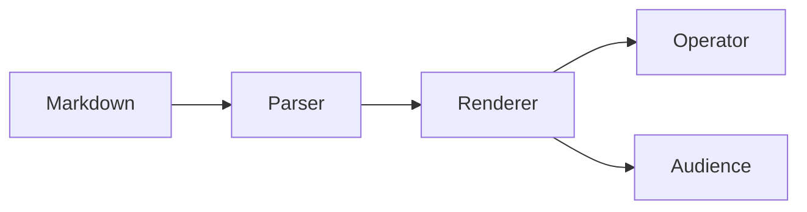

# Markdown,<br>ready for the stage.

One source file. Operator view, audience view, and PDF.

<!--
Welcome the audience and explain that this deck is the same Markdown file currently open in the editor.
-->

---
layout: section
kicker: Native workflow
---

# Edit beside it.<br>Present from it.

---

## Technical content stays technical

```swift
let deck = try DeckLoader().load(url)
session.load(deck.document)
```



<!--
Point out that Mermaid and highlighted code run from bundled assets, with no CDN dependency.
-->

---

## Local assets remain local


- Live reload keeps the current slide position.
- Speaker notes stay off the audience display.
- The renderer server listens only on loopback.

---
layout: backcover
---

# Keep writing.<br>Take the stage.
