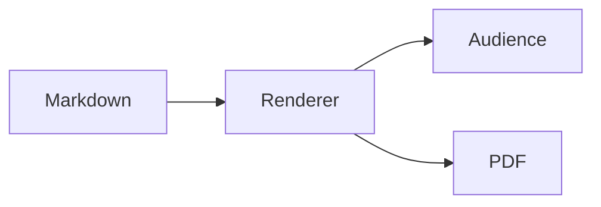

# One canvas.<br>Every output.

The cover background and logo come from local theme assets.

---
theme: light
layout: center
size: normal
kicker: GFM
---

## Structured content

> Preview, audience, thumbnail, and PDF share one render.

| Surface | Status |
| --- | --- |
| Current | Same |
| PDF | Same |

日本語の本文も同じ位置と書体で描画します。

---
theme: microsoft
size: normal
kicker: Local SVG
---

## Repository assets

<picture>
  <source srcset="  /assets/brand/markdstage-mark.svg#mark 1x" type="image/svg+xml">
  
</picture>

- SVG keeps its intrinsic aspect ratio.
- The image has a non-zero rendered size.

---
theme: dark
size: normal
kicker: Code and Mermaid
---

## Async rendering settles first

```swift
let canvas = CGSize(width: 1_280, height: 720)
render(slide, in: canvas)
```



<svg width="72" height="72" viewBox="0 0 72 72" role="img" aria-label="Local SVG image">
  <image href="/assets/brand/markdstage-mark.svg" width="72" height="72"></image>
</svg>

---
theme: custom
size: normal
kicker: Architecture
---

## Architecture DSL

```architecture
{
  "version": 1,
  "title": "Canonical rendering",
  "description": "A client sends Markdown through one renderer to every output surface.",
  "canvas": { "width": 1600, "height": 700 },
  "elements": [
    {
      "type": "node",
      "id": "source",
      "text": "Markdown",
      "icon": "assets/brand/markdstage-mark.svg",
      "x": 80,
      "y": 270,
      "width": 300,
      "height": 150
    },
    {
      "type": "group",
      "id": "outputs",
      "title": "Outputs",
      "x": 650,
      "y": 80,
      "width": 850,
      "height": 540,
      "layout": { "type": "row", "gap": 50, "padding": 50 },
      "children": [
        { "type": "node", "id": "preview", "text": "Preview", "icon": "browser" },
        { "type": "node", "id": "audience", "text": "Audience", "icon": "user" },
        { "type": "node", "id": "pdf", "text": "PDF", "icon": "server" }
      ]
    },
    {
      "type": "connector",
      "from": "source",
      "to": "preview",
      "routing": "orthogonal",
      "label": "render"
    }
  ]
}
```

---
theme: light
size: xlarge
kicker: Size modes
---

## Large type remains stable

- Fixed 1280 × 720 layout
- Aspect-fit at every window size

---
theme: custom
layout: backcover
kicker: Complete
---

# Rendering parity verified.
